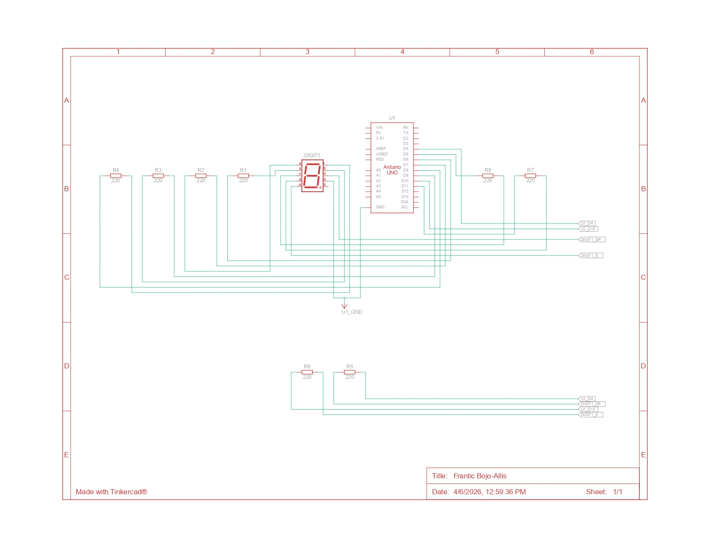

# Percobaan 2A: Seven Segment (GPIO Output)

## Jawaban Pertanyaan Praktikum 2.5.4

---

## 1. Gambarkan rangkaian schematic yang digunakan pada percobaan!

Rangkaian pada percobaan ini menggunakan seven segment 1 digit yang dihubungkan ke Arduino Uno melalui beberapa pin digital.




### Konfigurasi Rangkaian:

- Segmen a → Pin 7  
- Segmen b → Pin 6  
- Segmen c → Pin 5  
- Segmen d → Pin 11  
- Segmen e → Pin 10  
- Segmen f → Pin 8  
- Segmen g → Pin 9  
- Segmen dp → Pin 4  

### Penjelasan:

Setiap segmen pada seven segment dihubungkan ke Arduino melalui resistor 220Ω yang berfungsi untuk membatasi arus agar LED tidak rusak.

Jenis seven segment yang digunakan adalah **common cathode**, dimana semua kaki katoda disatukan dan dihubungkan ke GND. Dengan kondisi ini, LED akan menyala ketika pin Arduino diberi logika HIGH.

---

## 2. Apa yang terjadi jika nilai `num` lebih dari 15?

Pada program, data yang tersedia hanya untuk angka 0 sampai 15, yaitu angka 0–9 dan huruf A–F dalam sistem hexadecimal.

Jika nilai `num` lebih dari 15, maka program akan mengakses data di luar batas array. Hal ini menyebabkan tampilan pada seven segment menjadi tidak sesuai, seperti segmen menyala secara acak atau tidak membentuk angka yang benar.

Oleh karena itu, nilai `num` harus dibatasi hanya sampai 15 agar program berjalan dengan benar.

---

## 3. Apakah program ini menggunakan common cathode atau common anode? Jelaskan alasannya!

Program ini menggunakan **common cathode**.

Hal ini dapat diketahui dari cara kerja rangkaian, yaitu LED pada seven segment menyala ketika diberikan logika HIGH dari Arduino. Selain itu, kaki common pada seven segment dihubungkan ke GND.

Jika menggunakan common anode, LED seharusnya menyala pada logika LOW. Karena pada percobaan ini menggunakan logika HIGH untuk menyalakan LED, maka dapat dipastikan menggunakan common cathode.

---

## 4. Modifikasi program agar tampilan berjalan dari F ke 0

### Kode Program:

```cpp
const int segmentPins[8] = {7, 6, 5, 11, 10, 8, 9, 4};

byte digitPattern[16][8] = {
  {1,1,1,1,1,1,0,0}, //0
  {0,1,1,0,0,0,0,0}, //1
  {1,1,0,1,1,0,1,0}, //2
  {1,1,1,1,0,0,1,0}, //3
  {0,1,1,0,0,1,1,0}, //4
  {1,0,1,1,0,1,1,0}, //5
  {1,0,1,1,1,1,1,0}, //6
  {1,1,1,0,0,0,0,0}, //7
  {1,1,1,1,1,1,1,0}, //8
  {1,1,1,1,0,1,1,0}, //9
  {1,1,1,0,1,1,1,0}, //A
  {0,0,1,1,1,1,1,0}, //b
  {1,0,0,1,1,1,0,0}, //C
  {0,1,1,1,1,0,1,0}, //d
  {1,0,0,1,1,1,1,0}, //E
  {1,0,0,0,1,1,1,0}  //F
};

void setup() {
  for(int i=0; i<8; i++){
    pinMode(segmentPins[i], OUTPUT);
  }
}

void loop() {
  for(int num = 15; num >= 0; num--) {
    for(int i=0; i<8; i++){
      digitalWrite(segmentPins[i], digitPattern[num][i]);
    }
    delay(1000);
  }
}


```

---
Penjelasan Program 
```cpp
Setup
for(int i=0; i<8; i++)

Digunakan untuk melakukan perulangan pada seluruh pin yang terhubung ke seven segment.

pinMode(segmentPins[i], OUTPUT);

Mengatur semua pin sebagai output agar dapat mengontrol LED pada seven segment.

Loop Utama
for(int num = 15; num >= 0; num--)

Perulangan ini digunakan untuk menampilkan angka dari F (15) hingga 0 secara berurutan.

Menampilkan Pola
digitalWrite(segmentPins[i], digitPattern[num][i]);

Baris ini berfungsi untuk mengirimkan sinyal HIGH atau LOW ke masing-masing segmen sesuai dengan pola angka yang ingin ditampilkan.

Delay
delay(1000);

Digunakan untuk memberikan jeda selama 1 detik agar perubahan tampilan dapat terlihat dengan jelas.