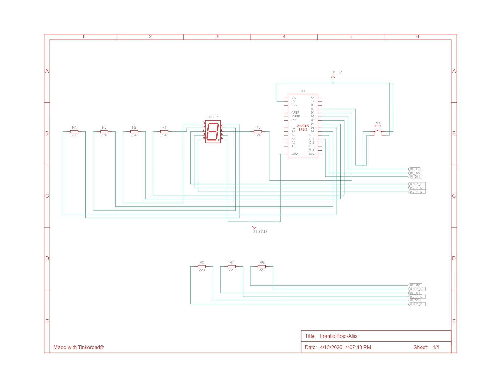

# Percobaan 2B: Kontrol Counter dengan Push Button

## Jawaban Pertanyaan Praktikum 2.6.4

---

## 1. Gambarkan rangkaian schematic yang digunakan pada percobaan!

Rangkaian pada percobaan ini menggunakan seven segment yang dikombinasikan dengan push button sebagai input.




---

### Konfigurasi Rangkaian

#### Seven Segment
- a → Pin 7  
- b → Pin 6  
- c → Pin 5  
- d → Pin 11  
- e → Pin 10  
- f → Pin 8  
- g → Pin 9  
- dp → Pin 4  

#### Push Button
- Button UP → Pin 3  
- Button DOWN → Pin 2  
- Kaki lainnya → GND  

---

### Penjelasan

Seven segment yang digunakan adalah **common cathode**, sehingga kaki common dihubungkan ke GND. LED akan menyala ketika diberi logika HIGH.

Push button menggunakan mode **INPUT_PULLUP**, sehingga:
- Tidak ditekan → HIGH  
- Ditekan → LOW  

---

## 2. Mengapa menggunakan INPUT_PULLUP? Apa keuntungannya?

Mode `INPUT_PULLUP` digunakan untuk mengaktifkan resistor internal pada Arduino.

### Penjelasan
Tanpa pull-up:
- Input menjadi **floating (tidak stabil)**
- Nilai dapat berubah-ubah sendiri

Dengan `INPUT_PULLUP`:
- Default bernilai HIGH  
- Saat ditekan menjadi LOW  

### Keuntungan
- Tidak perlu resistor tambahan  
- Rangkaian lebih sederhana  
- Menghindari noise dan pembacaan tidak stabil  

---

## 3. Jika salah satu LED segmen tidak menyala, apa penyebabnya?

### Dari sisi hardware
- Kabel jumper tidak terhubung dengan benar  
- Resistor tidak terpasang atau rusak  
- Salah pin pada seven segment  
- LED segmen rusak  
- Kaki common tidak terhubung ke GND  

### Dari sisi software
- Mapping pin tidak sesuai  
- Data pada `digitPattern` salah  
- Logika HIGH/LOW tidak sesuai tipe (CC/CA)  
- Kesalahan pada fungsi `displayDigit()`  

---

## 4. Modifikasi program dengan 2 push button (increment & decrement)

---

## Kode Program

```cpp
#include <Arduino.h>

// =================== PIN ==================
const int segmentPins[8] = {7, 6, 5 ,11, 10, 8, 9, 4};

const int btnUp = 3;
const int btnDown = 2;

// ================= DATA =================
byte digitPattern[16][8] = {
{1,1,1,1,1,1,0,0}, //0
{0,1,1,0,0,0,0,0}, //1
{1,1,0,1,1,0,1,0}, //2
{1,1,1,1,0,0,1,0}, //3
{0,1,1,0,0,1,1,0}, //4
{1,0,1,1,0,1,1,0}, //5
{1,0,1,1,1,1,1,0}, //6
{1,1,1,0,0,0,0,0}, //7
{1,1,1,1,1,1,1,0}, //8
{1,1,1,1,0,1,1,0}, //9
{1,1,1,0,1,1,1,0}, //A
{0,0,1,1,1,1,1,0}, //b
{1,0,0,1,1,1,0,0}, //C
{0,1,1,1,1,0,1,0}, //d
{1,0,0,1,1,1,1,0}, //E
{1,0,0,0,1,1,1,0}  //F
};

int currentDigit = 0;

bool lastUpState = HIGH;
bool lastDownState = HIGH;

// ============= FUNCTION ============
void displayDigit(int num)
{
  for(int i=0;i<8;i++)
  {
    digitalWrite(segmentPins[i], digitPattern[num][i]);
  }
}

// ================= SETUP ============
void setup() {
  for(int i=0;i<8;i++)
  {
    pinMode(segmentPins[i], OUTPUT);
  }

  pinMode(btnUp, INPUT_PULLUP);
  pinMode(btnDown, INPUT_PULLUP);

  displayDigit(currentDigit);
}

// ========== LOOP ============
void loop() {
  bool upState = digitalRead(btnUp);
  bool downState = digitalRead(btnDown);

  // tombol naik
  if(lastUpState == HIGH && upState == LOW)
  {
    currentDigit++;
    if(currentDigit > 15) currentDigit = 0;
    displayDigit(currentDigit);
  }

  // tombol turun
  if(lastDownState == HIGH && downState == LOW)
  {
    currentDigit--;
    if(currentDigit < 0) currentDigit = 15;
    displayDigit(currentDigit);
  }

  lastUpState = upState;
  lastDownState = downState;
}

```

---
Penjelasan Program 
```cpp
# Program Counter dengan 2 Push Button

## Setup
for(int i=0;i<8;i++)
- Mengatur semua pin seven segment sebagai OUTPUT

pinMode(btnUp, INPUT_PULLUP);
pinMode(btnDown, INPUT_PULLUP);
- Mengatur tombol sebagai input dengan pull-up internal

## Fungsi displayDigit
digitalWrite(segmentPins[i], digitPattern[num][i]);
- Menampilkan angka sesuai pola pada seven segment

## Loop Utama

### Tombol Naik (Increment)
if(lastUpState == HIGH && upState == LOW)
- Mendeteksi tombol ditekan

currentDigit++;
- Menambah nilai counter

if(currentDigit > 15) currentDigit = 0;
- Kembali ke 0 jika lebih dari F

### Tombol Turun (Decrement)
if(lastDownState == HIGH && downState == LOW)
- Mendeteksi tombol ditekan

currentDigit--;
- Mengurangi nilai counter

if(currentDigit < 0) currentDigit = 15;
- Kembali ke F jika kurang dari 0

## Update State
lastUpState = upState;
lastDownState = downState;
- Menyimpan kondisi sebelumnya untuk mendeteksi perubahan tombol